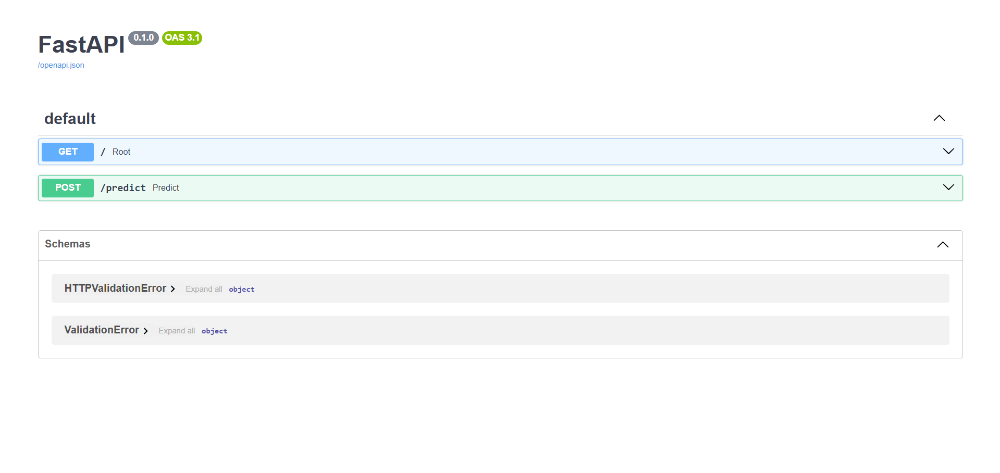

# Customer Churn Prediction ML System

## Overview

This project builds a machine learning model to predict **customer churn** for a telecommunications company.

Customer churn prediction helps businesses identify customers who are likely to cancel their service so that proactive retention strategies can be applied.

The system includes:

- A machine learning model trained with **scikit-learn**
- Data preprocessing and feature engineering
- A **FastAPI REST API** for real-time predictions
- A reproducible training pipeline

---

## Dataset

The dataset contains customer account information commonly used for churn prediction.

Key features include:

- Gender
- Senior citizen status
- Partner and dependents
- Tenure
- Internet service type
- Monthly charges
- Total charges

These variables are used as input features to train the churn prediction model.

---

## Machine Learning Model

The model was developed using **scikit-learn** and trained on historical customer data.

Training pipeline steps:

1. Data preprocessing and cleaning  
2. Feature encoding  
3. Train/test split  
4. Model training  
5. Model evaluation  
6. Saving the trained model  

---

## Model Performance

The model was evaluated using a **train/test split**.

Evaluation metric:

**Accuracy: ~78.5%**

This means the model correctly predicts whether a customer will churn approximately **78% of the time on unseen data**.

The trained model and scaler were saved using **joblib** and are used by the FastAPI service for real-time predictions.

---

## Project Structure

```
customer-churn-ml-khatantamir
│
├── app
│   └── main.py
│
├── data
│   └── telco_churn.csv
│
├── models
│   ├── churn_model.pkl
│   └── scaler.pkl
│
├── src
│   └── train.py
│
├── requirements.txt
└── README.md
```

---

## Technologies Used

- Python  
- pandas  
- scikit-learn  
- FastAPI  
- joblib  

---

## Running the Project

Install dependencies:

```
pip install -r requirements.txt
```

Run the API server:

```
uvicorn app.main:app --reload
```

Open the API documentation:

```
http://127.0.0.1:8000/docs
```

---

## API Endpoint

### POST `/predict`

Example input:

```
[0,1,0,12,85.5,1026]
```

The API returns the predicted churn result.

---

## API Demo

Below is the FastAPI interactive documentation used to test the churn prediction model.



---

## Author

**Khatantamir Otgonbyamba**
